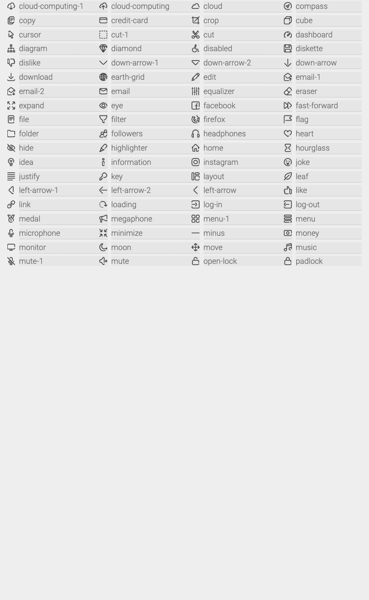

# Flutter UI Icons

Flutter icons set.

## Getting started

In the `pubspec.yaml` of your flutter project, add the following dependency:

```yaml
dependencies:
  ...
  flutter_ui_icons:
    git:
      url: git://github.com/fabirt/flutter-ui-icons.git
```

In your library add the following import:

```dart
import 'package:flutter_ui_icons/flutter_ui_icons.dart';
```

## Interface Icons
