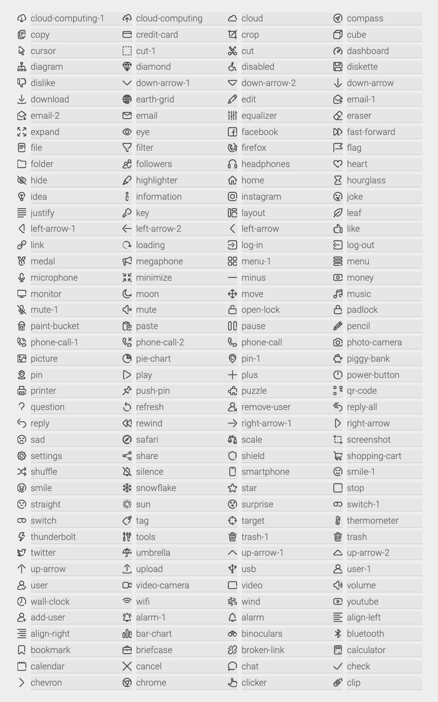

# Flutter UI Icons

Flutter icons set.

## Usage

Import the package:
```dart
import 'package:flutter_ui_icons/flutter_ui_icons.dart';
```
or import specific icons:
```dart
import 'package:flutter_ui_icons/flutter_ui_icons.dart' show InterfaceIcons;
```

## Interface Icons
